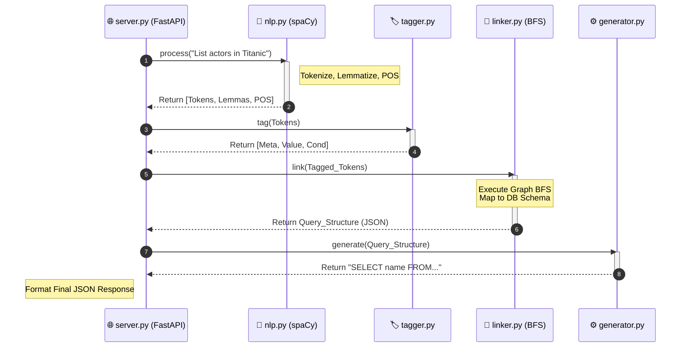
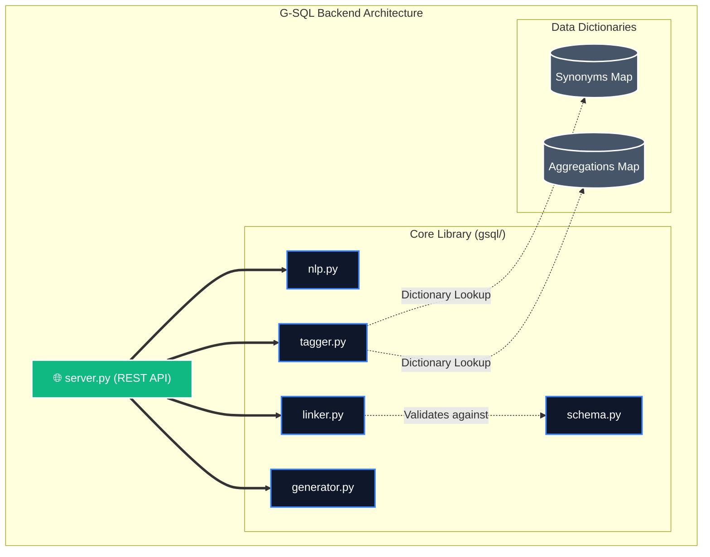
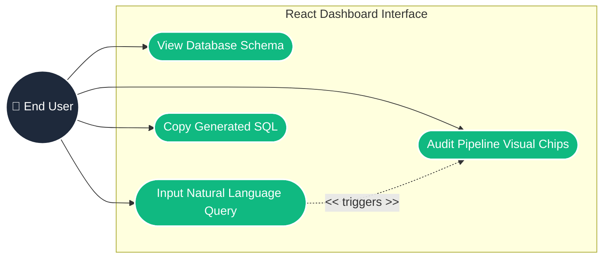
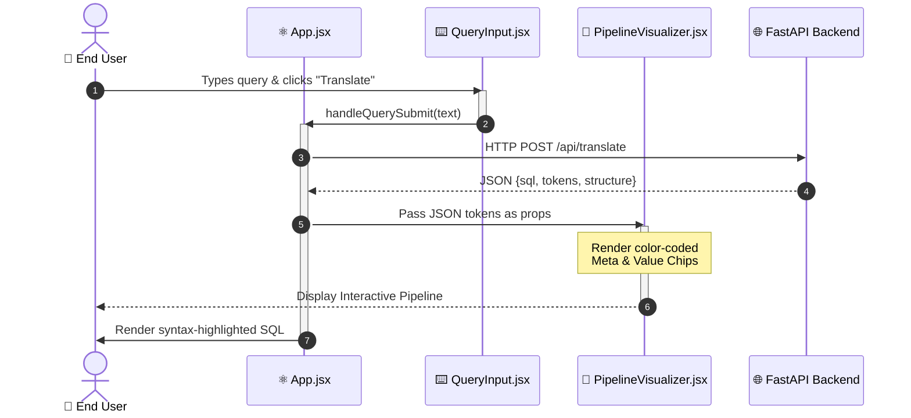
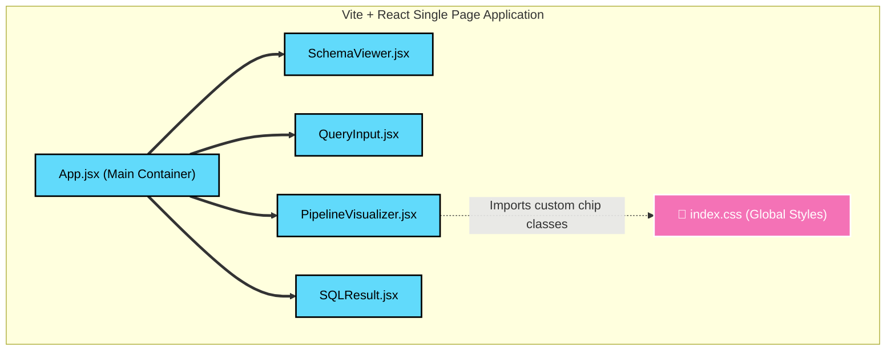
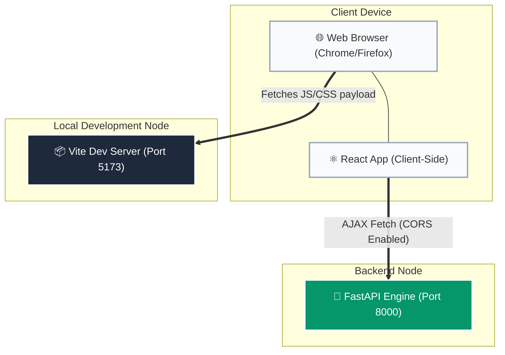

# System Architecture Diagrams

*The following 8 diagrams outline the architectural evolution of the G-SQL project across its two core development sprints. These diagrams use standard Mermaid syntax but are heavily styled for premium, publication-ready rendering on GitHub.*

---

## 1. Sprint I: Core G-SQL Engine (Backend)

### 1.1 Backend Use Case Diagram

```mermaid
graph LR
    classDef actor fill:#1e293b,stroke:#fff,stroke-width:2px,color:#fff,shape:circle;
    classDef usecase fill:#3b82f6,stroke:#fff,stroke-width:2px,color:#fff,shape:pill;
    classDef sys fill:#f8fafc,stroke:#cbd5e1,stroke-width:2px,stroke-dasharray: 5 5;

    Dev(("👤 Developer")):::actor
    
    subgraph "G-SQL Core Engine"
        direction TB
        UC1(["Submit NLQ String"]):::usecase
        UC2(["Parse & Lemmatize Tokens"]):::usecase
        UC3(["Assign Semantic Tags"]):::usecase
        UC4(["Infer Graph Joins (BFS)"]):::usecase
        UC5(["Generate SQL Syntax"]):::usecase
    end
    
    Dev --> UC1
    UC1 -. "<< includes >>" .-> UC2
    UC2 -. "<< includes >>" .-> UC3
    UC3 -. "<< includes >>" .-> UC4
    UC4 -. "<< includes >>" .-> UC5
    
    class "G-SQL Core Engine" sys;
```

### 1.2 Backend Sequence Diagram



### 1.3 Backend Component Diagram



### 1.4 Backend Deployment Diagram

```mermaid
graph TD
    classDef hardware fill:#e2e8f0,stroke:#64748b,stroke-width:2px;
    classDef software fill:#334155,stroke:#fff,stroke-width:2px,color:#fff;
    classDef external fill:#f59e0b,stroke:#fff,stroke-width:2px,color:#fff,shape:circle;

    Clients(("🌐 HTTP Clients")):::external

    subgraph "Local Development Machine"
        subgraph "Python 3.8+ Virtual Environment"
            Spacy[("spaCy en_core_web_sm")]:::software
            
            subgraph "Uvicorn ASGI Server"
                FastAPI["FastAPI Engine (Port 8000)"]:::software
            end
        end
    end
    
    Clients == "POST /api/translate" ==> FastAPI
    FastAPI -. "Loads Model into RAM" .-> Spacy
    
    class "Local Development Machine" hardware;
    class "Python 3.8+ Virtual Environment" hardware;
```

---

## 2. Sprint II: Interactive Visualization Interface (Frontend)

### 2.1 Frontend Use Case Diagram



### 2.2 Frontend Sequence Diagram



### 2.3 Frontend Component Diagram



### 2.4 Frontend Deployment Diagram


