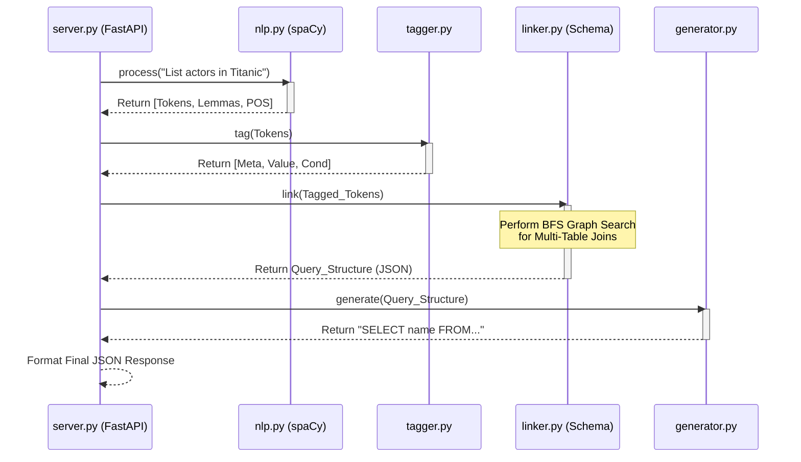
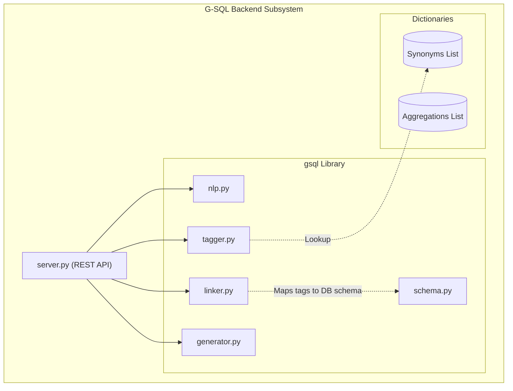
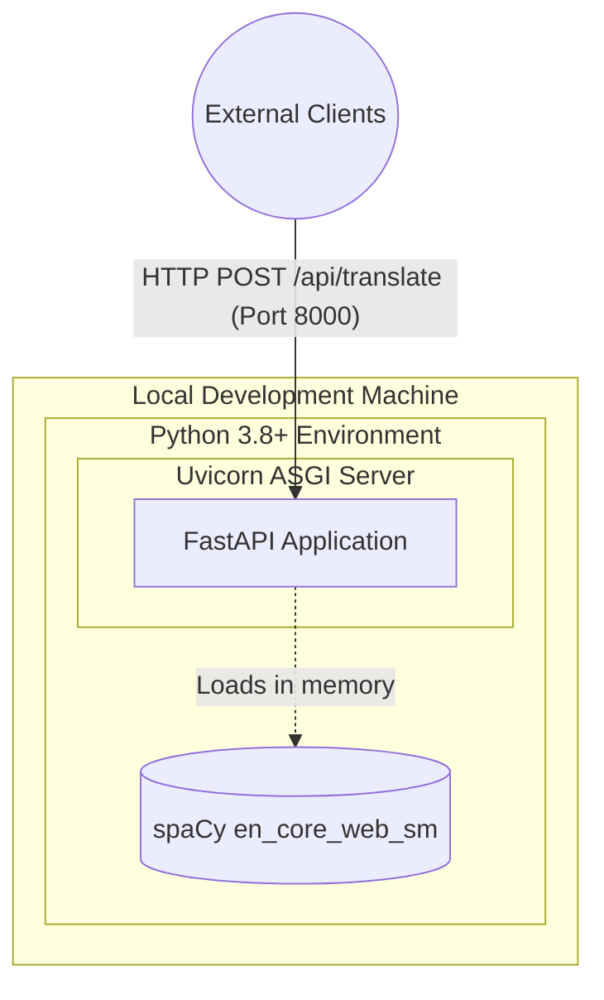
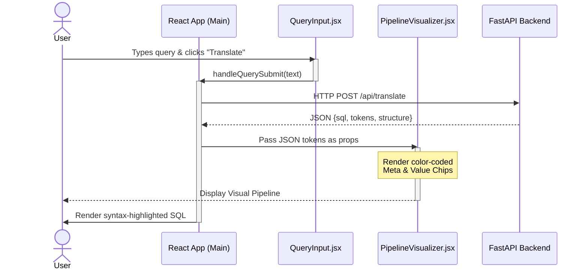
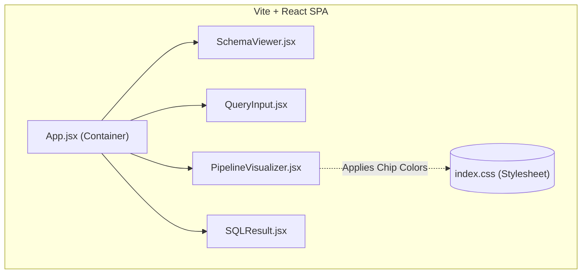
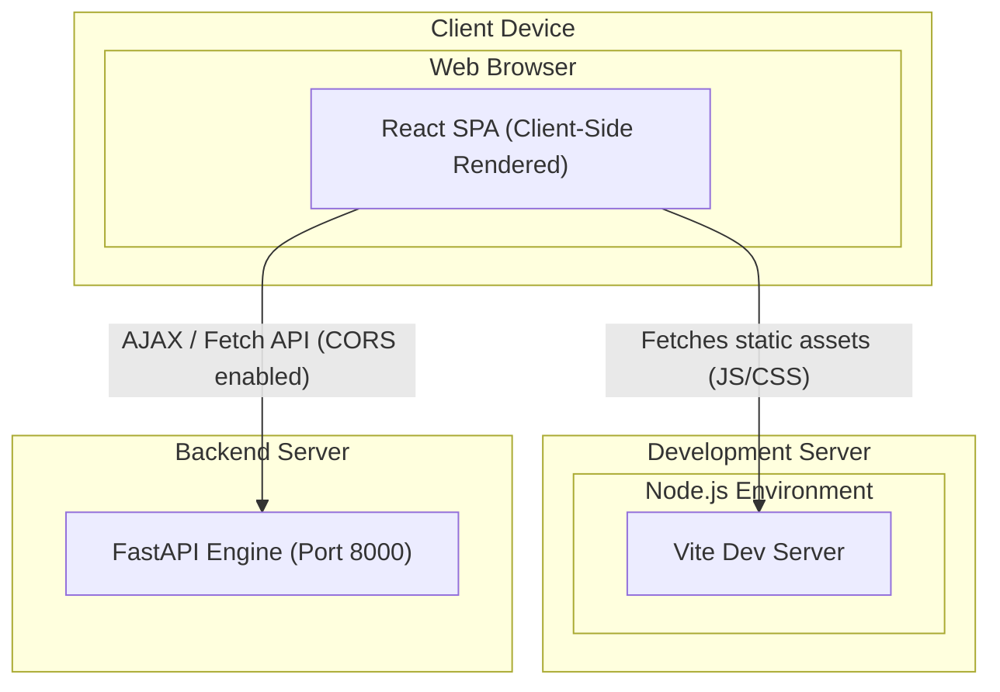

# System Architecture Diagrams

*The following 8 diagrams outline the architectural evolution of the G-SQL project across its two core development sprints. These diagrams use the standard Mermaid `flowchart` and `sequenceDiagram` syntax, which ensures compatibility with GitHub and Mermaid Live.*

---

## 1. Sprint I: Core G-SQL Engine (Backend)

During Sprint I, development focused entirely on the Python backend, the deterministic NLP pipeline, and the REST API.

### 1.1 Backend Use Case Diagram
*Illustrates the functional capabilities exposed by the backend engine.*

```mermaid
flowchart LR
    actor Developer[["Developer / System Client"]]
    
    subgraph CoreEngine ["G-SQL Core Engine"]
        UC1(["Submit NLQ String"])
        UC2(["Parse & Lemmatize Tokens"])
        UC3(["Assign Semantic Tags"])
        UC4(["Infer Graph Joins (BFS)"])
        UC5(["Generate SQL Syntax"])
    end
    
    Developer --> UC1
    UC1 -. "includes" .-> UC2
    UC2 -. "includes" .-> UC3
    UC3 -. "includes" .-> UC4
    UC4 -. "includes" .-> UC5
```

### 1.2 Backend Sequence Diagram
*Traces the chronological execution path of a single query through the Python modules.*



### 1.3 Backend Component Diagram
*Shows the structural relationships between the core Python modules.*



### 1.4 Backend Deployment Diagram
*Illustrates the localized hosting environment for the Python application.*



---

## 2. Sprint II: Interactive Visualization Interface (Frontend)

During Sprint II, development shifted to decoupling the user interface from the backend, focusing on building a modern React dashboard to visualize the pipeline.

### 2.1 Frontend Use Case Diagram
*Illustrates what the end-user can accomplish within the React application.*

```mermaid
flowchart LR
    actor User[["End User"]]
    
    subgraph Dashboard ["React Dashboard"]
        V1(["View Database Schema"])
        V2(["Input Natural Language"])
        V3(["View Pipeline Chips"])
        V4(["Copy Generated SQL"])
    end
    
    User --> V1
    User --> V2
    User --> V3
    User --> V4
    
    V2 -. "Triggers" .-> V3
```

### 2.2 Frontend Sequence Diagram
*Traces the asynchronous communication between the React components and the Python API.*



### 2.3 Frontend Component Diagram
*Breaks down the React component hierarchy.*



### 2.4 Frontend Deployment Diagram
*Shows the dual-node interaction between the browser, the frontend server, and the backend engine.*


