# Natural Language to SQL Component Architecture

This component architecture diagram integrates the structure of your existing rule-based NLP pipeline (from the local `frontend` and `gsql` Python codebase) with your requested Cloud implementation (Vercel, API Gateway, Cloud Functions with LangChain/LLM, and Database).

```mermaid
flowchart TB
    %% Styling
    classDef frontend fill:#0f172a,stroke:#3b82f6,stroke-width:2px,color:#f8fafc;
    classDef gateway fill:#f59e0b,stroke:#b45309,stroke-width:2px,color:#fff;
    classDef serverless fill:#1e293b,stroke:#10b981,stroke-width:2px,color:#f8fafc;
    classDef database fill:#3b82f6,stroke:#1d4ed8,stroke-width:2px,color:#fff;
    classDef label fill:none,stroke:none,color:#94a3b8;

    %% Client / Frontend Layer
    subgraph FrontendLayer ["💻 Frontend: React / Vercel (Static Hosting)"]
        direction TB
        UI_QueryInput["QueryInput.jsx\n(Search Bar)"]
        UI_SchemaViewer["SchemaViewer.jsx\n(DB Tables & Relationships)"]
        UI_PipelineVisual["PipelineVisualizer.jsx\n(Token & Tag Chips)"]
        UI_SQLResult["SQLResult.jsx\n(Final Generated SQL)"]

        UI_QueryInput --> UI_PipelineVisual
        UI_PipelineVisual --> UI_SQLResult
    end
    class FrontendLayer frontend;

    %% Routing Layer
    APIGateway{"🚀 API Gateway\n(Routes the Request)"}
    class APIGateway gateway;

    %% Backend / Processing Layer
    subgraph BackendLayer ["⚡ Cloud Function: Python Logic"]
        direction TB
        
        %% Combining LLM with structured steps
        LLM["LangChain / LLM Text-to-SQL"]
        
        subgraph Pipeline ["Structural Post-Processing"]
            direction TB
            NLP["NLP & Semantic Tagging\n(spaCy Parsing)"]
            Linker["Schema Mapping & Join Inference\n(Graph Based)"]
            Generator["SQL Generation & Validation"]
            
            NLP --> Linker
            Linker --> Generator
        end
        
        LLM -. "Fallback / Augmentation" .-> Pipeline
    end
    class BackendLayer serverless;

    %% Data Layer
    Database[("🗄️ Database\n(Actual Data Resides Here)")]
    class Database database;


    %% Relationships and Data Flow
    FrontendLayer -- "1. Sends NL Query\n(REST API)" --> APIGateway
    APIGateway -- "2. Routes Request" --> BackendLayer
    
    BackendLayer -- "3. Fetches Schema" --> Database
    Database -- "4. Returns Schema Context" --> BackendLayer
    
    BackendLayer -- "5. Execution / Returns Results\n(Tokens, Tags, SQL)" --> APIGateway
    
    APIGateway -- "6. Dispatches to UI Components" --> FrontendLayer

    style UI_QueryInput fill:#1e293b,stroke:#3b82f6
    style UI_SchemaViewer fill:#1e293b,stroke:#3b82f6
    style UI_PipelineVisual fill:#1e293b,stroke:#3b82f6
    style UI_SQLResult fill:#1e293b,stroke:#3b82f6
```

### Component Breakdown
1. **Frontend (React / Vercel)**: Inherits the architecture from your current `frontend/` folder. It uses `QueryInput` for capturing user sentences, `SchemaViewer` for depicting the database design, `PipelineVisualizer` to illustrate the NLP pipeline visually with color-coded chips, and `SQLResult` to show the final query. It is statically hosted on Vercel.
2. **API Gateway**: Serves as the networking router that securely captures HTTP requests from the React frontend and directs them to the backend serverless functions.
3. **Cloud Function (Python)**: Replaces the local FastAPI `server.py` setup. It uses the proposed **LangChain/LLM** approach to convert text to SQL, alongside the structured pipeline elements (Tokenization, Semantic Tagging, Schema Linking) to provide the necessary payload for the front end's visual token breakdown.
4. **Database**: The definitive target where tables and relationships reside, acting as the ground-truth for schema inferences and actual data querying.
