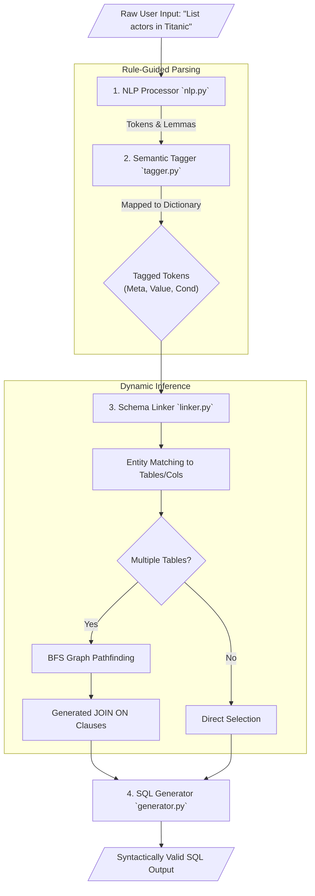

# 4.1.d Architecture Document

*This document contains the High-Level Design (HLD) and Detailed Design (LLD) for the G-SQL translation system. The Mermaid diagrams below will render directly in GitHub or any markdown editor that supports them, making them perfect for your presentation slides.*

---

## 1. High-Level Design (HLD)

The system adopts a decoupled client-server architecture. The frontend handles interactive visualization while the backend executes the deterministic rule-guided NLP pipeline.

```mermaid
graph LR
    User([End User]) -->|Natural Language Query| UI[React Frontend (Vite)]
    UI -->|JSON Request| API[FastAPI Server]
    API --> PIPELINE[G-SQL NLP Pipeline]
    
    subgraph "G-SQL Core Engine"
        PIPELINE --> DB_SCHEMA[(Virtual Database Schema)]
    end
    
    PIPELINE -->|SQL Query + Tokens| API
    API -->|JSON Response| UI
    UI -->|Render Chips & SQL| User
```

---

## 2. Detailed Design (LLD): The Translation Pipeline

The translation engine itself is a sequential pipeline consisting of four major sub-components. Each component feeds directly into the next, ensuring verifiable execution rather than black-box stochastic generation.



### Component Breakdown:
1.  **`nlp.py`:** Utilizes `spaCy` for tokenization and lemmatization.
2.  **`tagger.py`:** Assigns structural tags (Meta, Value, Cond, AGG) via dictionary lookup to segregate intent from data.
3.  **`linker.py`:** Maps Meta tags to the programmatic `DatabaseSchema` (Tables, Columns, Primary/Foreign Keys). The core heuristic is assigning Values to their nearest preceding explicit Column definition. When cross-table navigation is required, a BFS pathfinding algorithm discovers implicit JOINs.
4.  **`generator.py`:** Computes the final mapped entities into formal SQL arrays (`SELECT`, `FROM`, `WHERE`, `JOIN`) and concatenates them into formatted output.
